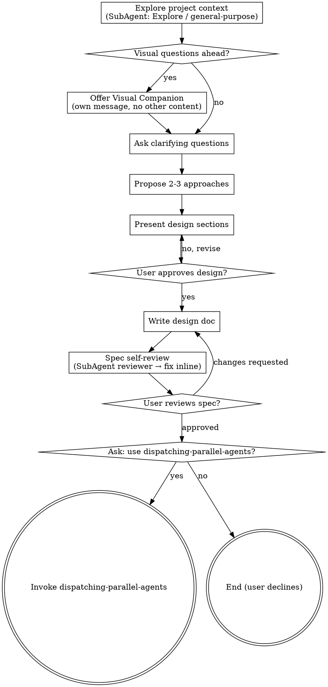

# 把想法转化为设计（Brainstorming Ideas Into Designs）

通过自然的协作对话，把想法转化成完整成型的设计与 spec。

先理解当前项目上下文，然后一次问一个问题逐步打磨想法。一旦弄清楚要构建什么，就把设计提出来并获得用户批准。

<HARD-GATE>
在你把设计提出来并获得用户批准之前，禁止调用任何实现类 skill、写任何代码、搭任何项目骨架或采取任何实现动作。该规则对**每一个**项目都适用，无论看起来多简单。
</HARD-GATE>

## 反模式："这太简单了不需要设计"

每个项目都要走这套流程：一份 todo 清单、一个单函数工具、一处配置改动 —— 全都一样。"简单"项目正是未经检视的假设造成最多无效返工的地方。设计可以很短（对真正简单的项目，几句话即可），但你**必须**把它提出来并获得批准。

## Checklist（清单）

你**必须**为下列每一项创建一个任务，并按顺序完成：

1. **Explore project context（探索项目上下文）** — **必须通过 SubAgent（`Agent` 工具，`subagent_type=Explore` 或 `general-purpose`）执行**代码库调查，主 Agent 自身禁止直接 Glob/Grep/Read 大批文件做摸底。SubAgent 返回结构化结论后，由主 Agent 汇总。
2. **Offer visual companion（提议视觉伴侣）**（如果话题会涉及视觉问题）—— 这必须是单独一条消息，不可与澄清式提问合并。参见下文的「视觉伴侣」一节。
3. **Ask clarifying questions（提出澄清式问题）** —— 一次一个，理解目的 / 约束 / 成功标准。
4. **Propose 2-3 approaches（提出 2-3 个方案）** —— 附权衡分析与你的推荐。
5. **Present design（呈现设计）** —— 按各部分复杂度分段呈现，每段都获得用户批准。
6. **Write design doc（写设计文档）** —— 保存到 `docs/superpowers/specs/YYYY-MM-DD-<topic>-design.md` 并 commit。
7. **Spec self-review（Spec 自审）** —— **必须派发 SubAgent（`general-purpose` 或 `Plan`）以"独立审阅者"身份检查写好的 spec 文件**，主 Agent 禁止自查自审；SubAgent 输出问题清单后由主 Agent 据此修订（详见下文）。
8. **User reviews written spec（用户审阅已写好的 spec）** —— 在继续之前请用户审阅 spec 文件。
9. **询问是否使用 dispatching-parallel-agents** —— 用户批准 spec 后，询问是否基于该 spec 文档使用 `dispatching-parallel-agents` 进行后续开发；如用户确认，则调用 `dispatching-parallel-agents` 进行开发。

## Process Flow（流程图）

**完成 spec 并经用户批准后，须询问是否基于该 spec 使用 `dispatching-parallel-agents` 进行后续开发。** 未经用户确认前，不得调用 `dispatching-parallel-agents` 或任何其它实现类 skill（如 frontend-design、mcp-builder 等）。

## 流程详解（The Process）

**理解想法：**

- 先了解当前项目状态（文件、文档、近期 commit）—— **此步骤必须派发 SubAgent 执行**：用 `Agent` 工具（优先 `subagent_type=Explore`，需要跨模块综合分析时用 `general-purpose`）让子代理去翻文件、读文档、看 `git log`，并要求其返回："相关文件路径 + 关键片段摘录 + 现有模式/约定总结"。主 Agent 不在主上下文直接做大范围 Glob/Grep/Read，只接收 SubAgent 的结构化结论用于后续提问与设计。
- 在开始提细节问题之前，先评估范围：如果用户描述的是多个独立子系统（例如"构建一个含聊天、文件存储、计费和数据分析的平台"），立即指出来。不要把问题花在一个其实需要先拆解的项目细节上。
- 如果项目对单份 spec 来说过大，帮用户拆分成子项目：哪些是相互独立的部分？它们如何关联？应该按什么顺序构建？然后按常规设计流程对第一个子项目做 brainstorming。每个子项目都有自己独立的 spec → plan → 实现 循环。
- 对范围合适的项目，一次问一个问题来打磨想法。
- 尽量用选择题（multiple choice），但开放式问题也可以。
- 每条消息只问一个问题 —— 如果某个话题需要更多探索，拆成多个问题。
- 关注点：目的（purpose）、约束（constraints）、成功标准（success criteria）。

**探索方案：**

- 提出 2-3 种不同方案，附权衡分析。
- 用对话化方式呈现选项，给出你的推荐与理由。
- 用推荐方案作为开头，并解释为什么。

**呈现设计：**

- 一旦你觉得理解了要构建什么，就把设计呈现出来。
- 各部分按复杂度伸缩：直截了当的几句话即可，有微妙之处的可以写 200-300 字。
- 每段之后问"到目前为止看起来对吗？"。
- 覆盖：架构、组件、数据流、错误处理、测试。
- 一旦有什么讲不通，要随时回头澄清。

**为隔离与清晰而设计：**

- 把系统拆成更小的单元，每个单元有一个明确的目的，通过定义良好的接口通信，并能被独立理解和测试。
- 对每个单元，你应当能回答：它做什么？怎么用？依赖什么？
- 别人能否在不读其内部实现的情况下理解一个单元的功能？你能否在不破坏调用方的前提下改其内部？如果不能，边界划分有问题。
- 更小、边界更清的单元也更便于你工作 —— 你对能完整放进上下文的代码推理得更好，而当文件聚焦时你的编辑也更可靠。当一个文件变大，往往就是它做得太多的信号。

**在既有代码库中工作：**

- 提出修改前先探索现有结构，遵循既有模式。**同样的硬性规定**：现有代码库的结构调研一律派发 SubAgent，主 Agent 不亲自做大范围检索；只在 SubAgent 返回结果后做点对点的针对性 Read（如确认单个函数签名）。
- 当既有代码存在影响本次工作的问题时（例如某个文件已经过大、边界不清、职责纠缠），把针对性的改进作为设计的一部分纳入 —— 像一个优秀开发者改进他正在动的代码那样。
- 不要提议无关的重构。保持聚焦于服务当前目标。

## 设计完成后（After the Design）

**文档化：**

- 把已验证的设计（spec）写到 `docs/superpowers/specs/YYYY-MM-DD-<topic>-design.md`
  - （用户对 spec 位置的偏好可覆盖此默认值）
- 如果可用，使用 elements-of-style:writing-clearly-and-concisely 这个 skill
- 把设计文档 commit 到 git

**Spec Self-Review（必须派发 SubAgent 执行）：**

写完 spec 后，**主 Agent 禁止自查自审**，必须派发 SubAgent（`subagent_type=general-purpose` 或 `Plan`）以"独立审阅者"视角检查 spec 文件，理由：自己写的文档由自己审阅几乎必然发现不了盲点；交给一个不带"作者偏见"的子代理才能暴露真问题，同时也避免在主上下文重复消耗 token 把刚写的内容再读一遍。

派发时给 SubAgent 的 prompt 必须显式要求覆盖下列 4 项检查，并要求其返回**"是否通过 / 问题清单（含文件位置与建议修订）"**：

1. **Placeholder scan（占位符扫描）：** 是否存在 "TBD"、"TODO"、未完成的段落或含糊的需求？
2. **Internal consistency（内部一致性）：** 各段落之间是否相互矛盾？架构与功能描述是否吻合？
3. **Scope check（范围检查）：** 这是否足够聚焦于单份实现计划，还是需要再拆分？
4. **Ambiguity check（歧义检查）：** 是否存在可以被两种方式解读的需求？

参考 prompt 片段可放在 `skills/brainstorming/spec-document-reviewer-prompt.md`（如已存在则直接复用）。主 Agent 收到 SubAgent 的问题清单后，**逐条 inline 修订** spec 文件；修订后若改动较大，可再派发一次 SubAgent 复查，否则不再循环，直接进入用户审阅环节。

**用户审阅 Gate：**

在 spec 审阅循环通过之后，请用户在继续之前审阅写好的 spec：

> "Spec 已写入并提交到 `<path>`。请审阅，告诉我是否需要修改后再进入后续开发。"

等待用户回复。如果用户提出修改，先改完再重跑 spec 审阅循环。只有在用户批准后才继续。

**询问是否使用 dispatching-parallel-agents：**

用户批准 spec 后，必须明确询问是否基于该 spec 文档使用 `dispatching-parallel-agents` 进行后续开发：

> "Spec 已通过。是否基于该 spec 使用 `dispatching-parallel-agents` 拆分独立任务并并行开发？（是 / 否）"

- 如用户确认（"是"/"用"/"go" 等），立即调用 `dispatching-parallel-agents` skill，并将 spec 路径作为输入传递，进入并行任务派发与执行流程。
- 如用户拒绝或希望另行处理，停在此处不再自动调用任何实现类 skill，由用户决定后续动作。
- 在用户明确回复之前，**不得**调用 `dispatching-parallel-agents` 或任何其它实现类 skill。

**派发 agent 时禁止使用 git worktree 隔离**：调用 `Agent` 工具时**不要**传 `isolation: "worktree"`；让所有 agent 直接在主工作目录内修改文件，由当前会话统一负责合并与提交。
- **原因**：worktree 子目录在 Windows 上会被 `node_modules` 等文件锁占用，`git worktree remove` 经常失败，导致 `.claude/worktrees/` 留下顽固残留；且需要额外把 worktree 改动 patch 回 main，徒增协调成本。
- **冲突管理由 spec 负责**：spec 应预先按"独立文件域 / 互不相交的修改范围"切分任务，让多个 agent 各自处理不同目录或文件，从源头避免相互覆盖，而不是依赖 worktree 物理隔离。
- **唯一例外**：当 agent 必须执行破坏性操作（如 `git reset --hard`、大范围分支重写）时才考虑 worktree；普通的并行实现任务一律不用。

## 关键原则（Key Principles）

- **一次一个问题** —— 不要用一堆问题压垮用户。
- **优先选择题** —— 比开放式问题更易回答。
- **狠抠 YAGNI** —— 从所有设计中删掉不必要的功能。
- **探索替代方案** —— 落地前永远先提 2-3 个方案。
- **增量校验** —— 呈现设计，得到批准后再往下走。
- **保持灵活** —— 一旦有什么不对劲，随时回头澄清。

## 视觉伴侣（Visual Companion）

brainstorming 期间用于展示 mockup、图示和视觉选项的浏览器伴侣。它是一个工具 —— 不是一种模式。接受伴侣意味着它在那些受益于视觉表达的问题上可用；**并不**意味着每个问题都要走浏览器。

**提议伴侣：** 当你预计接下来的问题会涉及视觉内容（mockup、布局、图示）时，只用一条消息一次性征求同意：
> "我们接下来要讨论的有些内容用浏览器展示给你会更直观。我可以一边讨论一边出 mockup、图示、对比等可视化素材。该功能尚新，比较费 token，要试一下吗？（需要打开一个本地 URL）"

**该提议必须独占一条消息。** 不要把它和澄清式提问、上下文总结或其它任何内容合在一起。这条消息只包含上面这段提议，其它一律不放。等用户答复后再继续。如果用户拒绝，就走纯文本 brainstorming。

**逐题决策：** 即使用户已经接受伴侣，仍要**对每个问题**单独决定走浏览器还是终端。判定标准：**用户"看到"它是否比"读"它更易理解？**

- **走浏览器** —— 内容本身就是视觉的：mockup、wireframe、布局对比、架构图、并排视觉设计。
- **走终端** —— 内容是文本：需求类问题、概念性选择、权衡列表、A/B/C/D 文本选项、范围决策。

涉及 UI 主题的问题并不自动等于视觉问题。"在这个语境里 personality 是什么意思？"是概念性问题 —— 走终端。"哪种 wizard 布局更合适？"是视觉问题 —— 走浏览器。

如果用户同意使用伴侣，在继续前先阅读详细指南：
`skills/brainstorming/visual-companion.md`
