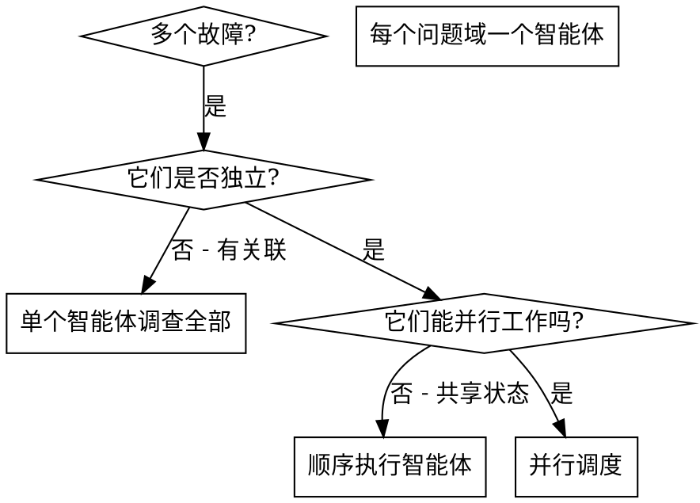

# 并行调度智能体

## 概述

你将任务委派给具有独立上下文的专用智能体。通过精心构建它们的指令和上下文，确保它们保持专注并成功完成任务。它们绝不应继承你会话的上下文或历史记录——你需要精确构建它们所需的一切。这也为你保留了用于协调工作的自身上下文。

当你遇到多个互不相关的故障（不同的测试文件、不同的子系统、不同的 bug）时，按顺序调查它们是在浪费时间。每个调查都是独立的，可以并行进行。

**核心原则：** 每个独立的问题域派发一个智能体。让它们并发工作。

## 何时使用



**适用场景：**
- 3 个以上测试文件失败，且根因不同
- 多个子系统独立损坏
- 每个问题无需其他问题的上下文即可理解
- 调查之间无共享状态

**不适用场景：**
- 故障之间有关联（修复一个可能会修复其他）
- 需要理解完整的系统状态
- 智能体之间会相互干扰

## 模式

### 1. 识别独立域

按损坏的内容对故障进行分组：
- 文件 A 测试：工具审批流程
- 文件 B 测试：批量完成行为
- 文件 C 测试：中止功能

每个域都是独立的——修复工具审批不会影响中止测试。

### 2. 创建专注的智能体任务

每个智能体获得：
- **具体范围：** 一个测试文件或子系统
- **明确目标：** 让这些测试通过
- **约束条件：** 不要更改其他代码
- **预期输出：** 你发现和修复的内容摘要

### 3. 并行调度

```typescript
// 在 Claude Code / AI 环境中
Task("修复 agent-tool-abort.test.ts 中的失败")
Task("修复 batch-completion-behavior.test.ts 中的失败")
Task("修复 tool-approval-race-conditions.test.ts 中的失败")
// 三个任务并发运行
```

### 4. 审查与集成

当智能体返回时：
- 阅读每个摘要
- 验证修复是否冲突
- 运行完整测试套件
- 集成所有更改

## 智能体提示结构

好的智能体提示应具备：
1. **专注** - 一个清晰的问题域
2. **自包含** - 理解问题所需的全部上下文
3. **输出具体** - 智能体应该返回什么？

```markdown
修复 src/agents/agent-tool-abort.test.ts 中 3 个失败的测试：

1. "should abort tool with partial output capture" - 期望消息中包含 'interrupted at'
2. "should handle mixed completed and aborted tools" - 快速工具被中止而非完成
3. "should properly track pendingToolCount" - 期望 3 个结果但得到 0

这些都是时序/竞态条件问题。你的任务：

1. 阅读测试文件并理解每个测试验证的内容
2. 识别根本原因——时序问题还是实际 bug？
3. 通过以下方式修复：
   - 将任意超时替换为基于事件的等待
   - 如果发现 abort 实现中的 bug，则修复
   - 如果测试的是已更改的行为，则调整测试预期

不要只是增加超时时间——找到真正的问题。

返回：你发现和修复的内容摘要。
```

## 常见错误

**❌ 范围太广：** "修复所有测试" - 智能体会迷失方向
**✅ 具体：** "修复 agent-tool-abort.test.ts" - 范围聚焦

**❌ 无上下文：** "修复竞态条件" - 智能体不知道在哪
**✅ 有上下文：** 粘贴错误消息和测试名称

**❌ 无约束：** 智能体可能会重构所有内容
**✅ 有约束：** "不要更改生产代码" 或 "仅修复测试"

**❌ 输出模糊：** "修复它" - 你不知道改了什么
**✅ 具体：** "返回根本原因和更改摘要"

## 何时不使用

**相关故障：** 修复一个可能会修复其他——先一起调查
**需要完整上下文：** 理解需要看到整个系统
**探索性调试：** 你还不知道哪里坏了
**共享状态：** 智能体会相互干扰（编辑相同文件、使用相同资源）

## 来自会话的真实示例

**场景：** 重大重构后 3 个文件中 6 个测试失败

**故障：**
- agent-tool-abort.test.ts: 3 个失败（时序问题）
- batch-completion-behavior.test.ts: 2 个失败（工具未执行）
- tool-approval-race-conditions.test.ts: 1 个失败（执行计数 = 0）

**决策：** 独立域——中止逻辑与批量完成、竞态条件相互独立

**调度：**
```
智能体 1 → 修复 agent-tool-abort.test.ts
智能体 2 → 修复 batch-completion-behavior.test.ts
智能体 3 → 修复 tool-approval-race-conditions.test.ts
```

**结果：**
- 智能体 1：将超时替换为基于事件的等待
- 智能体 2：修复事件结构 bug（threadId 位置错误）
- 智能体 3：添加等待异步工具执行完成

**集成：** 所有修复相互独立，无冲突，完整套件通过

**节省时间：** 3 个问题并行解决 vs 顺序解决

## 关键优势

1. **并行化** - 多个调查同时进行
2. **专注** - 每个智能体范围狭窄，需要跟踪的上下文更少
3. **独立性** - 智能体之间不会相互干扰
4. **速度** - 3 个问题在 1 个问题的时间内解决

## 验证

智能体返回后：
1. **审查每个摘要** - 了解更改了什么
2. **检查冲突** - 智能体是否编辑了相同代码？
3. **运行完整套件** - 验证所有修复能否协同工作
4. **抽查** - 智能体可能会犯系统性错误

## 实际影响

来自调试会话（2025-10-03）：
- 3 个文件中 6 个失败
- 3 个智能体并行调度
- 所有调查并发完成
- 所有修复成功集成
- 智能体更改之间零冲突
