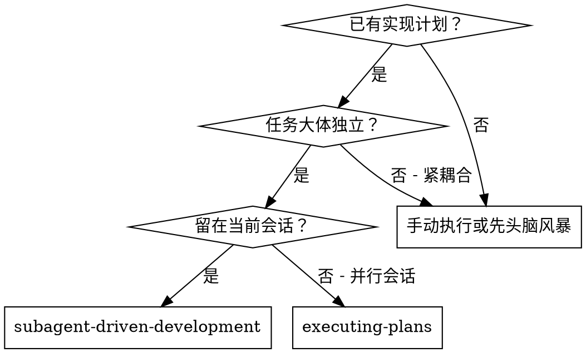
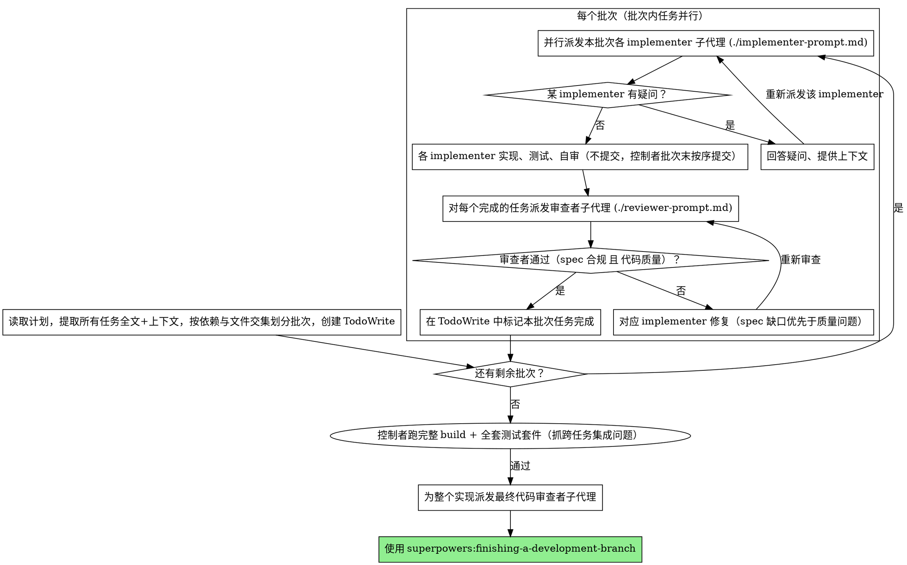

# Subagent-Driven Development（子代理驱动开发）

按计划执行：把任务按依赖与文件交集划成批次，**同一批次内不相交的任务并行派发子代理**；每个任务完成后由**一个审查者一次性审查 spec 合规 + 代码质量**。

**为什么用子代理：** 你把任务委派给上下文隔离的专职代理。通过精确地构造它们的指令与上下文，你确保它们专注且能完成任务。它们绝不应继承你会话的上下文或历史——你只为它们构造它们真正需要的东西。这同时也为你自己保留了用于协调工作的上下文。

**核心原则：** 不相交任务并行派发 + 单一审查者（一次覆盖 spec 合规与代码质量）= 高质量、快迭代

## 何时使用

**对比 Executing Plans（并行会话）：**
- 同一会话（无需切换上下文）
- 每个任务一个全新子代理（不污染上下文）
- 不相交任务在同一批次内并行推进
- 每个任务后单一审查：spec 合规 + 代码质量一次到位
- 迭代更快（任务之间无需人工介入）

## 划分并行批次（wave）

并行的前提是任务**不相交**。开工前先把计划里的全部任务分成若干批次：

**两个任务可放进同一批次（可并行）当且仅当：**
1. **改动文件集不重叠** —— 不会写同一个文件
2. **无先后依赖** —— 任务 B 不需要任务 A 的产物才能开工（**注意：模块/import 依赖也算先后依赖**——若 B 的代码要 import 任务 A **新建**的模块/类型，B 的类型检查器/编译器在 A 未完成时会报"找不到模块"，故 B 必须排在 A 之后。"改动文件不重叠"只看写入，看不到 import 依赖——划分批次时务必检查任务间是否存在对**尚未存在的文件**的 import）
3. **无隐性共享产物竞争** —— 不同时跑写同一产物目录的命令（见下"并行验证命令安全"）

不满足任一条件的任务排到后续批次（批次之间串行）。一个批次的所有任务都验收通过后，再开下一个批次（下一批次可依赖上一批次的产物）。

**并行验证命令安全：** 会清空并重写产物目录的构建命令（各语言生态的 `build`，输出到 `dist/`/`build/`/`target/` 等）是**隐性共享文件集**——两个 subagent 并发跑同一个 build 会互相损坏产物（一个清理目录时另一个在写入，产出不可预测）。因此并行 implementer 的验证步骤只用：
- **只读的类型检查 / lint**（只校验、不写产物，如各语言"检查但不编译"模式）—— 安全
- **隔离的单元测试**（每个测试文件独立、不写共享产物目录）—— 安全

**build 由控制者在批次末统一跑一次**，不放进并行 implementer 的验证。写任务卡时，对**同一批次内的并行任务**，"验证"段落只用"只读检查 + 隔离测试"，不要写会重写产物目录的构建命令。串行批次（单个 implementer）则不受此限，可照常 build。

**非代码产物的验证盲区：** 单元测试只覆盖代码逻辑。数据库迁移 SQL / shell 脚本 / 配置文件 / 模板等产物，单元测试完全碰不到——SQL 语法错误、表名/外键冲突、脚本路径错误、模板字符编码问题，只有实际执行或专门校验才能暴露。涉及这类产物的任务，任务卡的"验证"段落不能只写单元测试，必须额外包含产物本身的正确性验证：
- **数据库迁移 SQL**：在 dev 库上实际跑一遍，确认表建出来、无语法/外键错误；或至少语法检查（dry-run）
- **shell/构建脚本**：语法校验（如 `bash -n`、PowerShell 的 `[scriptblock]::Create`）或实际执行
- **配置/模板**：加载测试或 schema 校验

控制者验收这类任务时，要确认 implementer 不只是"单元测试通过"，还验证了非代码产物本身。

**并行提交的 git 安全：** 同一分支上多个 implementer 并发提交会抢占 git 索引。做法固定一种：**令并行 implementer 只实现 + 测试、不提交**，由控制者在批次结束后按任务逐个提交其不相交的文件集。

**禁止用 git worktree 隔离**（即调用 `Agent` 工具时不要传 `isolation: "worktree"`）：worktree 子目录常被依赖目录（如 `node_modules`、`.venv`、`target` 等）的文件锁占用，`git worktree remove` 经常失败、留下顽固残留，还要额外把改动 patch 回主分支。冲突应靠"按不相交文件域切批次"从源头避免，而非靠 worktree 物理隔离。唯一例外：agent 必须执行破坏性操作（`git reset --hard`、大范围分支重写）时才考虑 worktree。

拿不准两个任务是否真不相交时，**当作相交、排进不同批次**——错误的并行会制造冲突，代价远高于少一点并行度。

**单任务工作量上限：** 派发前预估每个任务的工作量。即使一个任务和别的任务不相交，若它会创建/删除/重写大量文件（例如批量删除 >30 个文件、重写一整个模块、生成大量样板代码），也应**提前拆成多个子任务**（串行或并行），而非塞给单个 subagent——单个 subagent 上下文膨胀会导致它读不全文件、遗漏边界、自审失真。经验阈值：单任务改动文件数 >20，或净增/删行数 >1000 时，考虑拆分。任务过大时 subagent 往往会自己 BLOCKED 上报，但**提前拆分比事后补救代价更低**——控制者在划分批次阶段就应识别这类大任务。

## 流程

每个任务的审查彼此独立，因此**同一批次的审查者也可并行派发**（一个任务一个审查者）。某任务通过验收即可标记完成，无需等批次内其他任务。

**最终验证（所有批次完成后、最终审查前，由控制者亲自跑）：** 单任务审查只看本任务的 spec 合规与代码质量，**跨任务的集成问题（模块 import 路径错、类型不匹配、新组件未在框架中注册、路由/接线漏挂）没有任何单任务闸门能抓到**。因此所有批次完成、派发最终代码审查者之前，控制者必须**单线程**跑一次完整构建 + 全套测试套件（不是派给并行 subagent）：
- 该项目技术栈的完整构建命令（编译/打包全部产物，不是子集）
- 该项目技术栈的全套测试套件（整个测试集，不是单任务的子集）

全绿后再派发最终代码审查者。若构建/测试失败，失败点通常指向某个任务的隐性集成缺口——修完重跑，全绿才进入 finishing。**不要**把这一步省略或交给某个 subagent，它是整个实现唯一的跨任务集成闸门。

## 模型选择

在每个角色上使用能胜任的最弱模型，以节省成本、提升速度。

**机械性实现任务**（孤立函数、清晰的 spec、1-2 个文件）：用又快又便宜的模型。当计划写得足够明确时，大多数实现任务都是机械性的。

**集成与判断类任务**（多文件协调、模式匹配、调试）：用标准模型。

**架构、设计与审查类任务**：用现有最强的模型。

**任务复杂度信号：**
- 触及 1-2 个文件且 spec 完整 → 便宜模型
- 触及多个文件且涉及集成问题 → 标准模型
- 需要设计判断或对代码库的广泛理解 → 最强模型

## 处理 implementer 状态

implementer 子代理会报告四种状态之一。分别妥善处理：

**DONE：** 进入审查（一个审查者覆盖 spec 合规 + 代码质量）。

**DONE_WITH_CONCERNS：** implementer 完成了工作，但标记了疑虑。在继续之前先读这些疑虑。如果疑虑关乎正确性或范围，先解决再审查。如果只是观察（例如"这个文件变大了"），记录下来并继续审查。

**NEEDS_CONTEXT：** implementer 需要未提供的信息。补齐缺失的上下文并重新派发。

**BLOCKED：** implementer 无法完成任务。评估阻塞点：
1. 若是上下文问题，提供更多上下文并用同一模型重新派发
2. 若任务需要更强的推理，换更强的模型重新派发
3. 若任务太大，拆成更小的片段
4. 若计划本身有问题，上报给人类

**绝不要**忽视上报，也不要在不做任何改变的情况下强迫同一模型重试。如果 implementer 说它卡住了，那就一定有东西需要改变。

并行批次中，逐个处理各 implementer 的状态：DONE 的任务可立即进入审查，无需等同批次其他任务收尾。

## Prompt 模板

- `./implementer-prompt.md` - 派发 implementer 子代理
- `./reviewer-prompt.md` - 派发审查者子代理（一次覆盖 spec 合规 + 代码质量）

## 危险信号（Red Flags）

**绝不要：**
- 未经用户明确同意就在 main/master 分支上开始实现
- 跳过审查（审查者须同时覆盖 spec 合规与代码质量）
- 带着未修复的问题继续推进
- **并行派发共享文件或有先后依赖的任务**（会冲突——只有不相交任务才能同批次并行）
- 拿不准是否不相交时仍强行并行（当作相交、排进不同批次）
- 让并行 implementer 各自向同一分支提交（会抢 git 索引——并行任务应只实现 + 测试不提交，由控制者批次末按序提交）
- **让并行 subagent 各自跑会重写产物目录的构建命令**（产物目录是隐性共享文件集，并发写互相损坏——并行批次内的验证只用"只读检查 + 隔离测试"，构建由控制者批次末统一跑一次）
- **把"要 import 同批次新建文件"的任务排进同一批次**（B 的类型检查器在 A 未完成时报"找不到模块"——import 依赖也算先后依赖，B 必须排 A 之后）
- **所有批次完成后跳过完整构建 + 全套测试、直接派最终审查**（跨任务集成问题无其他闸门能抓——控制者必须亲自单线程跑一次完整构建 + 全套测试套件，全绿才进 finishing）
- **涉及数据库迁移 / 脚本 / 配置等非代码产物的任务只靠单元测试验证**（单元测试碰不到 SQL 语法/外键冲突/脚本路径——这类产物必须实际执行或专门校验）
- **把批量删改几十个文件的大任务塞给单个 subagent**（上下文膨胀致遗漏/自审失真——文件数 >20 或净改行 >1000 时提前拆分）
- 用 git worktree 隔离来跑并行（依赖目录文件锁致 `git worktree remove` 失败、残留难清；仅破坏性操作例外）
- 让子代理去读计划文件（应改为提供全文）
- 省略场景铺垫上下文（子代理需要理解任务所处的位置）
- 忽视子代理的提问（让它们继续前先回答）
- 在 spec 合规上接受"差不多就行"（审查者发现 spec 问题 = 没做完）
- 跳过审查循环（审查者发现问题 = implementer 修复 = 再次审查）
- 让 implementer 的自审替代真正的审查（两者都需要）
- 审查仍有未决问题时就把该任务标记完成、推进下一批次

**如果子代理提问：**
- 清晰、完整地回答
- 如有需要，提供额外上下文
- 不要催它们赶紧进实现

**如果审查者发现问题：**
- 由 implementer（同一个子代理）修复，**先补 spec 缺口，再修质量问题**
- 审查者再次审查
- 重复直到 spec 合规 ✅ 且 代码质量 ✅
- 不要跳过重新审查

**如果子代理任务失败：**
- 派发修复子代理并给出具体指令
- 不要手动去修（会污染上下文）
