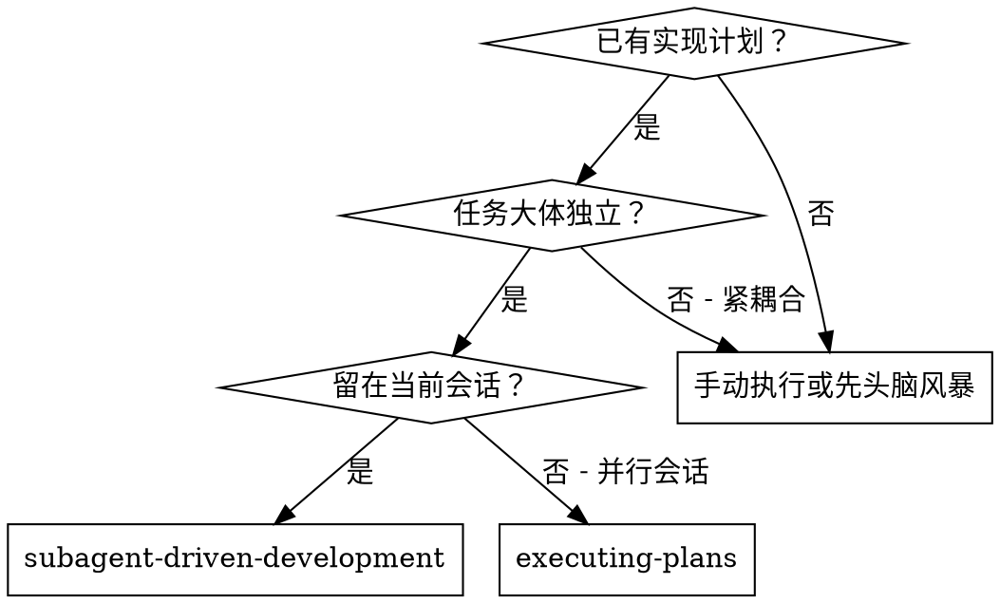
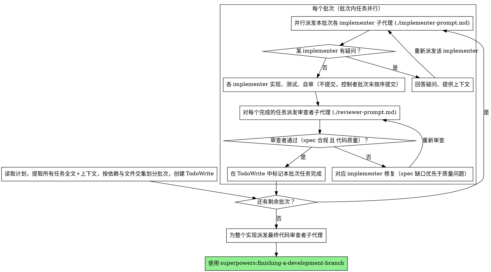

# Subagent-Driven Development（子代理驱动开发）

按计划执行：把任务按依赖与文件交集划成批次，**同一批次内不相交的任务并行派发子代理**；每个任务完成后由**一个审查者一次性审查 spec 合规 + 代码质量**。

**为什么用子代理：** 你把任务委派给上下文隔离的专职代理。通过精确地构造它们的指令与上下文，你确保它们专注且能完成任务。它们绝不应继承你会话的上下文或历史——你只为它们构造它们真正需要的东西。这同时也为你自己保留了用于协调工作的上下文。

**核心原则：** 不相交任务并行派发 + 单一审查者（一次覆盖 spec 合规与代码质量）= 高质量、快迭代

## 何时使用



**对比 Executing Plans（并行会话）：**
- 同一会话（无需切换上下文）
- 每个任务一个全新子代理（不污染上下文）
- 不相交任务在同一批次内并行推进
- 每个任务后单一审查：spec 合规 + 代码质量一次到位
- 迭代更快（任务之间无需人工介入）

## 划分并行批次（wave）

并行的前提是任务**不相交**。开工前先把计划里的全部任务分成若干批次：

**两个任务可放进同一批次（可并行）当且仅当：**
1. **改动文件集不重叠** —— 不会写同一个文件
2. **无先后依赖** —— 任务 B 不需要任务 A 的产物才能开工

不满足任一条件的任务排到后续批次（批次之间串行）。一个批次的所有任务都验收通过后，再开下一个批次（下一批次可依赖上一批次的产物）。

**并行提交的 git 安全：** 同一分支上多个 implementer 并发提交会抢占 git 索引。做法固定一种：**令并行 implementer 只实现 + 测试、不提交**，由控制者在批次结束后按任务逐个提交其不相交的文件集。

**禁止用 git worktree 隔离**（即调用 `Agent` 工具时不要传 `isolation: "worktree"`）：worktree 子目录在 Windows 上会被 `node_modules` 等文件锁占用，`git worktree remove` 经常失败、`.claude/worktrees/` 留下顽固残留，还要额外把改动 patch 回主分支。冲突应靠"按不相交文件域切批次"从源头避免，而非靠 worktree 物理隔离。唯一例外：agent 必须执行破坏性操作（`git reset --hard`、大范围分支重写）时才考虑 worktree。

拿不准两个任务是否真不相交时，**当作相交、排进不同批次**——错误的并行会制造冲突，代价远高于少一点并行度。

## 流程



每个任务的审查彼此独立，因此**同一批次的审查者也可并行派发**（一个任务一个审查者）。某任务通过验收即可标记完成，无需等批次内其他任务。

## 模型选择

在每个角色上使用能胜任的最弱模型，以节省成本、提升速度。

**机械性实现任务**（孤立函数、清晰的 spec、1-2 个文件）：用又快又便宜的模型。当计划写得足够明确时，大多数实现任务都是机械性的。

**集成与判断类任务**（多文件协调、模式匹配、调试）：用标准模型。

**架构、设计与审查类任务**：用现有最强的模型。

**任务复杂度信号：**
- 触及 1-2 个文件且 spec 完整 → 便宜模型
- 触及多个文件且涉及集成问题 → 标准模型
- 需要设计判断或对代码库的广泛理解 → 最强模型

## 处理 implementer 状态

implementer 子代理会报告四种状态之一。分别妥善处理：

**DONE：** 进入审查（一个审查者覆盖 spec 合规 + 代码质量）。

**DONE_WITH_CONCERNS：** implementer 完成了工作，但标记了疑虑。在继续之前先读这些疑虑。如果疑虑关乎正确性或范围，先解决再审查。如果只是观察（例如"这个文件变大了"），记录下来并继续审查。

**NEEDS_CONTEXT：** implementer 需要未提供的信息。补齐缺失的上下文并重新派发。

**BLOCKED：** implementer 无法完成任务。评估阻塞点：
1. 若是上下文问题，提供更多上下文并用同一模型重新派发
2. 若任务需要更强的推理，换更强的模型重新派发
3. 若任务太大，拆成更小的片段
4. 若计划本身有问题，上报给人类

**绝不要**忽视上报，也不要在不做任何改变的情况下强迫同一模型重试。如果 implementer 说它卡住了，那就一定有东西需要改变。

并行批次中，逐个处理各 implementer 的状态：DONE 的任务可立即进入审查，无需等同批次其他任务收尾。

## Prompt 模板

- `./implementer-prompt.md` - 派发 implementer 子代理
- `./reviewer-prompt.md` - 派发审查者子代理（一次覆盖 spec 合规 + 代码质量）

## 示例工作流

```
你：我正在用 Subagent-Driven Development 来执行这个计划。

[一次性读取计划文件：docs/superpowers/plans/feature-plan.md]
[提取全部 5 个任务的全文与上下文]
[分析依赖与文件交集，划分批次：
   批次 1（并行）：任务 1（hook 安装脚本，触及 install/*）、任务 2（恢复模式，触及 recovery/*）—— 文件不重叠、无依赖
   批次 2（串行在后）：任务 3 依赖任务 1 的产物 ……]
[用全部任务创建 TodoWrite]

== 批次 1：任务 1 与任务 2 并行 ==

[同一条消息里并行派发两个实现子代理，各带完整任务文本 + 上下文；明确要求只实现 + 测试、不提交，由我批次末统一提交]

implementer#1（任务 1）："开始之前——hook 应该安装在用户级还是系统级？"
你："用户级（~/.config/superpowers/hooks/）"
implementer#2（任务 2）：[无疑问，直接开始]

[稍后，两者各自回报]
implementer#1：实现 install-hook、5/5 通过、自审补上漏掉的 --force、未提交（交控制者）
implementer#2：加了 verify/repair 模式、8/8 通过、自审一切正常、未提交（交控制者）

[对两个完成的任务并行派发审查者，各自一次审 spec + 质量]

审查者#1（任务 1）：
  spec 合规：✅ 所有需求满足，无多余
  代码质量：优点——覆盖好、干净；问题——无
  总评：✅ 通过
[控制者提交任务 1 的文件，标记任务 1 完成]

审查者#2（任务 2）：
  spec 合规：❌ 缺失"每 100 项报告进度"；多余 --json 标志（未要求）
  代码质量：Important——魔法数字 100
  总评：❌ 需修复（先补进度上报 + 去掉 --json，再抽 PROGRESS_INTERVAL 常量）

[implementer#2 修复：先解 spec 缺口（加进度上报、移除 --json），再解质量（抽常量）]
[审查者#2 重新审查]
审查者#2：spec 合规 ✅；代码质量 ✅；总评 ✅ 通过
[控制者提交任务 2 的文件，标记任务 2 完成]

== 批次 1 全部通过，进入批次 2 ==

...

[所有批次完成后]
[派发最终 code-reviewer]
最终审查者：所有需求都满足，可以合并

完成！
```

## 优势

**对比手动执行：**
- 子代理天然遵循 TDD
- 每个任务上下文全新（不混淆）
- 不相交任务并行推进，整体墙钟时间更短
- 子代理可以提问（开工前和开工中都可以）

**对比 Executing Plans：**
- 同一会话（无需交接）
- 持续推进（无需等待）
- 审查检查点自动化

**效率收益：**
- 无读文件开销（控制者提供全文）
- 控制者精确筛选所需的上下文
- 子代理一开始就拿到完整信息
- 疑问在开工前就浮现（而非开工后）
- 批次内并行：N 个不相交任务的墙钟约等于其中最慢的一个，而非求和

**质量闸门：**
- 自审在交接前抓出问题
- 单一审查者一次覆盖 spec 合规与代码质量（spec 缺口优先于质量问题）
- 审查循环确保修复真正生效
- spec 合规防止过度/不足构建；代码质量确保实现做得扎实

**成本：**
- 更多子代理调用（每个任务 implementer + 1 个审查者）
- 控制者要做更多准备工作（预先提取全部任务、划分批次、判断不相交）
- 审查循环增加迭代次数
- 但能尽早抓出问题（比事后调试更便宜）

## 危险信号（Red Flags）

**绝不要：**
- 未经用户明确同意就在 main/master 分支上开始实现
- 跳过审查（审查者须同时覆盖 spec 合规与代码质量）
- 带着未修复的问题继续推进
- **并行派发共享文件或有先后依赖的任务**（会冲突——只有不相交任务才能同批次并行）
- 拿不准是否不相交时仍强行并行（当作相交、排进不同批次）
- 让并行 implementer 各自向同一分支提交（会抢 git 索引——并行任务应只实现 + 测试不提交，由控制者批次末按序提交）
- 用 git worktree 隔离来跑并行（本项目禁用：Windows 上 `node_modules` 文件锁致 `git worktree remove` 失败、残留难清；仅破坏性操作例外）
- 让子代理去读计划文件（应改为提供全文）
- 省略场景铺垫上下文（子代理需要理解任务所处的位置）
- 忽视子代理的提问（让它们继续前先回答）
- 在 spec 合规上接受"差不多就行"（审查者发现 spec 问题 = 没做完）
- 跳过审查循环（审查者发现问题 = implementer 修复 = 再次审查）
- 让 implementer 的自审替代真正的审查（两者都需要）
- 审查仍有未决问题时就把该任务标记完成、推进下一批次

**如果子代理提问：**
- 清晰、完整地回答
- 如有需要，提供额外上下文
- 不要催它们赶紧进实现

**如果审查者发现问题：**
- 由 implementer（同一个子代理）修复，**先补 spec 缺口，再修质量问题**
- 审查者再次审查
- 重复直到 spec 合规 ✅ 且 代码质量 ✅
- 不要跳过重新审查

**如果子代理任务失败：**
- 派发修复子代理并给出具体指令
- 不要手动去修（会污染上下文）

## 集成

**必需的工作流 skills：**
- **superpowers:requesting-code-review** - 供审查者子代理使用的代码审查模板
- **superpowers:finishing-a-development-branch** - 所有任务完成后收尾开发

**子代理应使用：**
- **superpowers:test-driven-development** - 子代理对每个任务遵循 TDD
