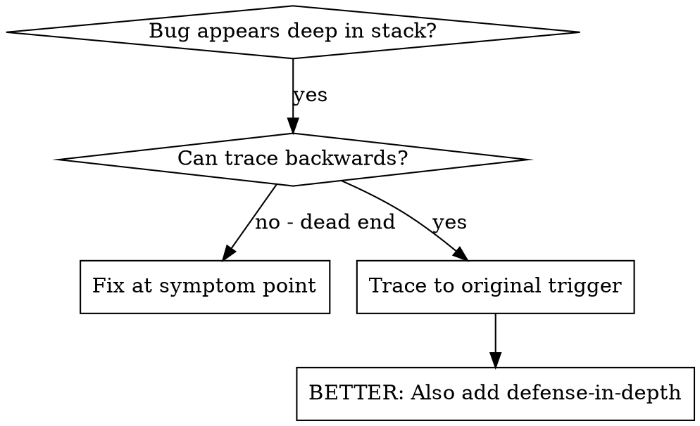
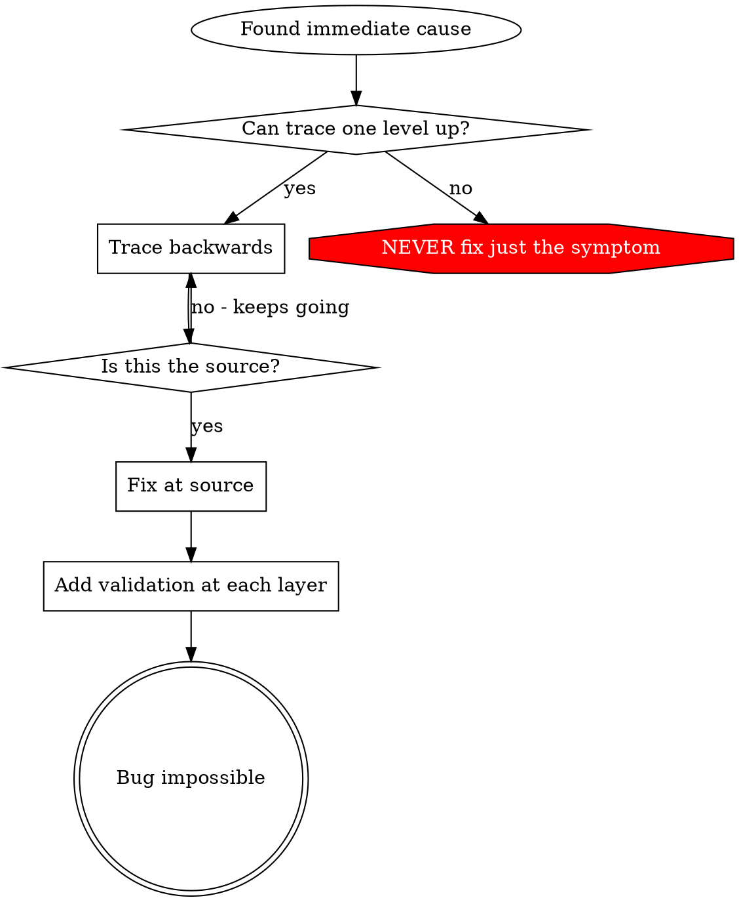

# 根因追踪（Root Cause Tracing）

## 概述

Bug 常常表现在调用栈的深处（git init 在错误目录、文件创建在错误位置、数据库以错误路径打开）。你的本能是在错误出现的地方修复它，但那是在治标。

**核心原则：** 沿调用链反向追踪，直到找到最初的触发点，然后在源头修复。

## 何时使用



**在以下情况使用：**
- 错误发生在执行的深处（而非入口点）
- stack trace 显示出很长的调用链
- 不清楚无效数据从哪里产生
- 需要找出是哪个测试/代码触发了问题

## 追踪流程

### 1. 观察症状
```
Error: git init failed in /Users/jesse/project/packages/core
```

### 2. 找到直接原因
**是哪段代码直接导致了这个问题？**
```typescript
await execFileAsync('git', ['init'], { cwd: projectDir });
```

### 3. 追问：是什么调用了它？
```typescript
WorktreeManager.createSessionWorktree(projectDir, sessionId)
  → called by Session.initializeWorkspace()
  → called by Session.create()
  → called by test at Project.create()
```

### 4. 持续向上追踪
**传入了什么值？**
- `projectDir = ''`（空字符串！）
- 空字符串作为 `cwd` 会解析为 `process.cwd()`
- 那就是源代码目录！

### 5. 找到最初的触发点
**空字符串是从哪里来的？**
```typescript
const context = setupCoreTest(); // Returns { tempDir: '' }
Project.create('name', context.tempDir); // Accessed before beforeEach!
```

## 加入 Stack Trace

当你无法手动追踪时，加入埋点：

```typescript
// Before the problematic operation
async function gitInit(directory: string) {
  const stack = new Error().stack;
  console.error('DEBUG git init:', {
    directory,
    cwd: process.cwd(),
    nodeEnv: process.env.NODE_ENV,
    stack,
  });

  await execFileAsync('git', ['init'], { cwd: directory });
}
```

**关键：** 在测试中使用 `console.error()`（不要用 logger —— 可能不显示）

**运行并捕获：**
```bash
npm test 2>&1 | grep 'DEBUG git init'
```

**分析 stack trace：**
- 寻找测试文件名
- 找到触发该调用的行号
- 识别出模式（同一个测试？同一个参数？）

## 找出是哪个测试造成了污染

如果某些东西在测试期间出现，但你不知道是哪个测试导致的：

使用本目录下的二分查找脚本 `find-polluter.sh`：

```bash
./find-polluter.sh '.git' 'src/**/*.test.ts'
```

它会逐个运行测试，在第一个造成污染的测试处停下。用法见脚本。

## 真实示例：空的 projectDir

**症状：** `.git` 创建在了 `packages/core/`（源代码目录）

**追踪链：**
1. `git init` 在 `process.cwd()` 中运行 ← cwd 参数为空
2. WorktreeManager 被以空的 projectDir 调用
3. Session.create() 传入了空字符串
4. 测试在 beforeEach 之前就访问了 `context.tempDir`
5. setupCoreTest() 初始时返回 `{ tempDir: '' }`

**根因：** 顶层变量初始化时访问了空值

**修复：** 把 tempDir 改成一个 getter，若在 beforeEach 之前被访问则抛出异常

**同时加入了纵深防御：**
- 第 1 层：Project.create() 校验目录
- 第 2 层：WorkspaceManager 校验非空
- 第 3 层：NODE_ENV 守卫拒绝在 tmpdir 之外执行 git init
- 第 4 层：在 git init 前记录 stack trace 日志

## 关键原则



**永远不要只在错误出现的地方修复。** 反向追踪，找到最初的触发点。

## Stack Trace 小贴士

**在测试中：** 用 `console.error()` 而非 logger —— logger 可能被抑制
**在操作之前：** 在危险操作之前记录日志，而非在它失败之后
**包含上下文：** 目录、cwd、环境变量、时间戳
**捕获调用栈：** `new Error().stack` 能显示完整的调用链

## 实战效果

来自调试会话（2025-10-03）：
- 通过 5 层追踪找到了根因
- 在源头修复（getter 校验）
- 加入了 4 层防御
- 1847 个测试通过，零污染
